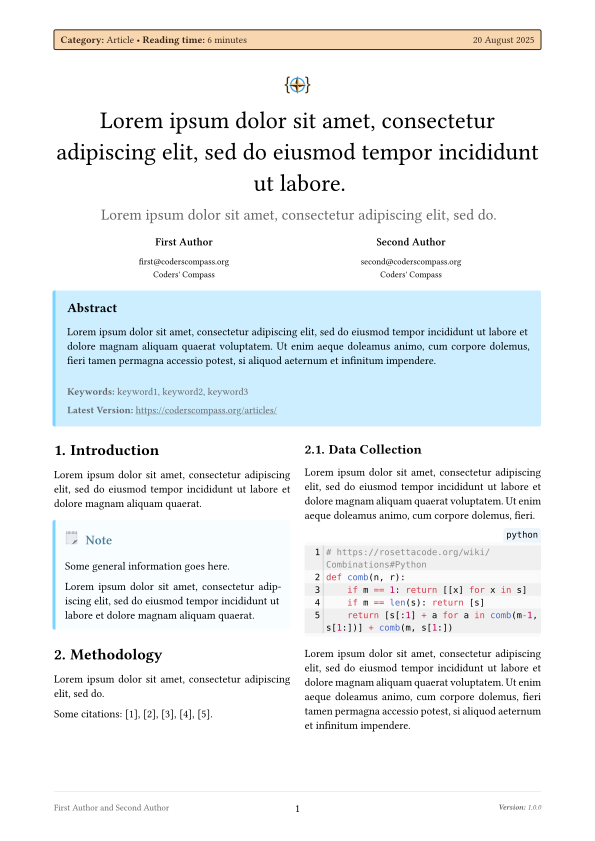
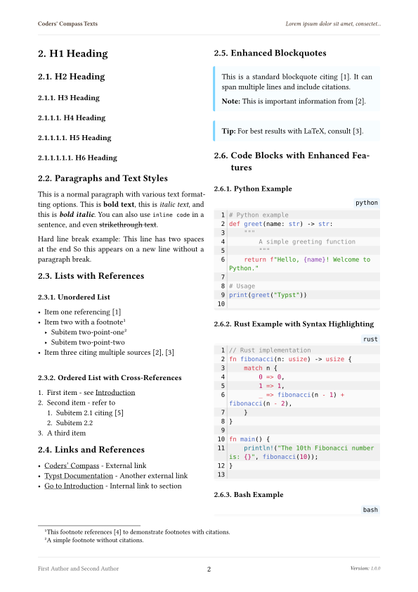

# The `articulate-coderscompass` Package
<div align="center">Version 0.1.0</div>

Template for a two column article layout for the [Coders' Compass website](https://coderscompass.org). It allows users to write articles in markdown or Typst, which can then be rendered to a PDF suitable for print.

Uses Coders' Compass branding and styling.

## Template adaptation checklist

- [ ] Fill out `README.md`
  - Change the `my-package` package name, including code snippets
  - Check section contents and/or delete sections that don't apply
- [x] Check and/or replace `LICENSE` by something that suits your needs
- [x] Fill out `typst.toml`
  - See also the [typst/packages README](https://github.com/typst/packages/?tab=readme-ov-file#package-format)
- [ ] Adapt or deactivate the release workflow in `.github/workflows/release.yml`
  - to deactivate it, delete that file or remove/comment out lines 2-4 (`on:` and following)
  - to use the workflow
    - [ ] check the values under `env:`, particularly `REGISTRY_REPO`
    - [ ] if you don't have one, [create a fine-grained personal access token](https://github.com/settings/tokens?type=beta) with [only Contents permission](https://stackoverflow.com/a/75116350/371191) for the `REGISTRY_REPO`
    - [ ] on this repo, create a secret `REGISTRY_TOKEN` (at `https://github.com/[user]/[repo]/settings/secrets/actions`) that contains the so created token

    if configured correctly, whenever you create a tag `v...`, your package will be pushed onto a branch on the `REGISTRY_REPO`, from which you can then create a pull request against [typst/packages](https://github.com/typst/packages/)
- [ ] remove/replace the example test case
- [ ] (add your actual code, docs and tests)
- [ ] remove this section from the README

## Getting Started

1. Start with the [main.typ](template/main.typ) file which imports the `articulate-coderscompass` package and demonstrates its usage.
2. Open it in the [Typst Web App](https://typst.app) or use the [Typst CLI](https://github.com/typst/typst) to render it.




## Usage

```typst
#import "@preview/articulate-coderscompass:0.1.0": *

#show: articulate-coderscompass.with(
  title: lorem(15),
  subtitle: lorem(10),
  authors: (
    (name: "First Author", email: "first@coderscompass.org", affiliation: "Coders' Compass"),
    (name: "Second Author", email: "second@coderscompass.org", affiliation: "Coders' Compass"),
    // (name: "Third Author", email: "third@coderscompass.org", affiliation: "Coders' Compass"),
  ),
  abstract: [
    #lorem(40)
  ],
  keywords: (
    "keyword1",
    "keyword2",
    "keyword3",
  ),
  version: "1.0.0",
  reading-time: "6 minutes",
  date: datetime.today(),
  bibliography: bibliography("refs.bib", style: "institute-of-electrical-and-electronics-engineers")
)

#render-markdown(read("content.md"))

// Or write Typst directly

= Article Title

Content here.

```

Refer to the [manual](docs/manual.pdf) for detailed documentation on available features and customization options.

You don't have to use the `render-markdown` function. Write Typst directly if you prefer. The reason we use markdown is to have a single manuscript source which can be rendered to both HTML (for the website) and PDF (for print).

## Development

Convenience commands for developers and contributors to compile the template, generate the manual, and create thumbnail images.

```bash
# Compiling the template
typst c template/main.typ

# Generating the manual
typst c src/manual.typ docs/manual.pdf

# Thumbnail images
typst c template/main.typ --format=png assets/images/page-{p}.png
typst c template/main.typ --format=svg assets/images/page-{p}.svg

# Running tests with tytanic
tt run
tt run test1
tt run unit1
```

Remember to copy any changes to `template/main.typ` to the test case in `tests/test1/test.typ`. Also ensure that the contents file is copied over.

## License

This project is **partially** licensed under the [MIT License](LICENSE). This includes all code files and the documentation (manual).
Only exception: the Coders' Compass branding assets, specifically the [logo](assets/images/cc-icon.png).

All rights reserved to Coders' Compass for the branding assets (logo).
